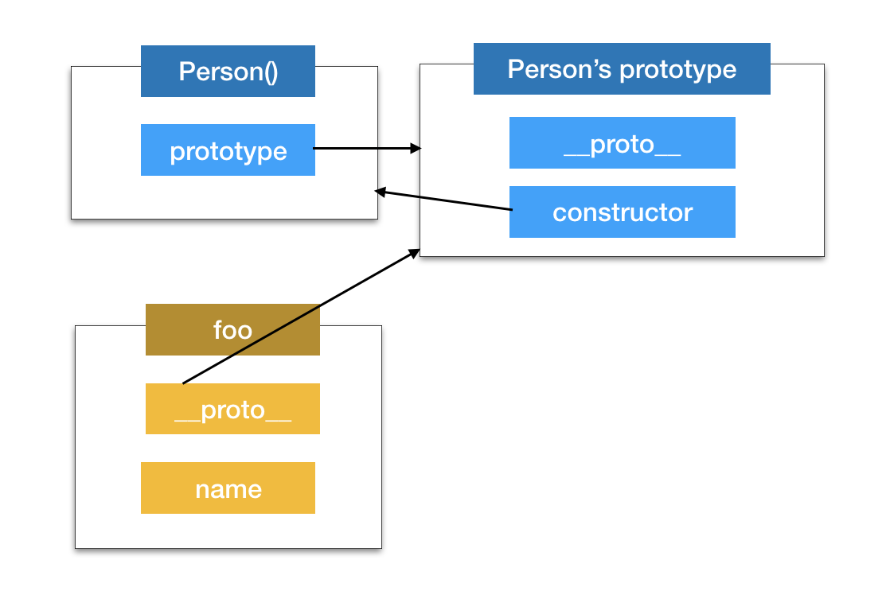

# Prototype
## 발표자

- 이상아

## 참여자

- 김라희, 김주완, 안소현, 양유성


## 내용

> 이 글은 2020년 1월 29일에 업데이트 되었습니다.
> 이전에 `[[Prototype]]` 과 `__proto__` 를 다르다고 생각하여 작성했던 내용을 고쳤습니다.


## `[[Prototype]]`, `__proto__`, `prototype` 의 차이
`JavaScript` 에서 변수와 함수는 원형을 갖는 객체이다. 그리고 `JavaScript` 에서는 이 원형을 `__proto__`(이하 `[[Prototype]]`) 과 `prototype` 으로 나타낸다.

`prototype` 은 **프로토타입 객체** 를 말하는 것이고,
`__proto__` 는 **프로토타입 링크** 를 말하는 것이다. 

이를 자세히 알아보자.

```javascript
function Person(name) { 
  this.name = name;
}

var foo = new Person('foo');
```

이런 코드가 있을 때, 이는 아래와 같은 그림으로 나타낼 수 있다.



## 프로토타입 체이닝
보다시피 객체 `lee` 는 `__proto__` 를 통해 `Human's Prototype` 에 접근할 수 있다. 
이처럼 **`__proto__` 프로퍼티를 타고 자신의 부모 역할을 하는 프로토타입 객체의 프로퍼티를 차례대로 검색하는 것을 프로토타입 체이닝이라고 한다.**

### 예시
```javascript
console.log(foo.hasOwnProperty('name')); // true
```
`foo 객체` 는 `hasOwnProperty` 를 갖고 있지 않다. 그렇다면 어떻게 저 함수를 사용해서 결과값을 볼 수 있었을까?


프로토타입 체이닝을 했기 때문이다.

먼저 자신의 부모인 `Person의 prototype` 을 갔고, 거기서 찾지 못하자 `__proto__` 를 타고 프로토타입 체이닝의 종점인 `Object의 prototype` 를 방문했다. 그리고 거기서 찾으려고 하는 `hasOwnProperty()` 메소드를 찾을 수 있었다.

## 프로토타입은 상속의 방법일까?
답을 먼저 말하자면 상속보다는 **위임**이 맞는 표현이다.

```javascript
var foo = new Person('foo');
```
이러한 코드가 있을 때, 기존 클래스 기반 객체지향 언어에서는 이를 `Person의 인스턴스인 foo를 만들었다` 라고한다.
자바스크립트는 이와 달리 `Person의 prototype에 접근할 수 있는 권한을 갖는 객체 foo를 만들었다`라고 한다.

즉 `foo` 에다가 `Person` 의 인스턴스를 만들어 그대로 넣어주는 것(복사)이 아니라, `Person` 의 `prototype`에 **접근할 수 있게끔(공유)** 하는 것이다. 그리고 접근은 `__proto__` 를 통해서 하는 것이다.

그래서 **상속** 이라는 표현 보다는, 권한의 **위임** 이라는 표현이 적합하다고 할 수 있다.


## Reference
- [opentutorials: `__proto__` vs `prototype`](https://www.opentutorials.org/module/4047/24629)
- 인사이드 자바스크립트 